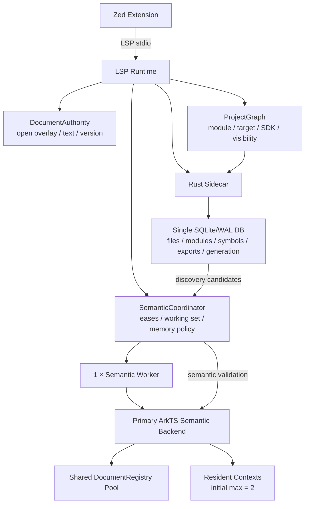

# Zed + ArkTS Language Server：官方语义后端与超大型工程低内存执行计划

状态：当前权威执行计划；Foundation 与 Backend Spike S1 已完成，下一步为独立 Spike Host S2。

计划基线：`e90cacb9ace47292ac0869d09b3a64f7c7fe2144`（P2.1b，PR #5）。

本计划接管 [P1/P2.1 历史执行计划](2026-09-07-large-project-reuse-execution-plan.md)
之后的工作顺序。旧计划继续保存已经合并的工程模型、references freshness、交付和测试证据，
但不再要求先做旧 P2.2；新的首要风险是验证 ETS-aware 官方语义前端能否成为唯一语义真值。

## 1. 目标与不可违反的约束

目标架构收敛为：

> 官方 ArkTS 语义前端 + 薄 SemanticCoordinator + 单语义 Worker + Rust/SQLite 全局发现。

项目竞争力不在重新实现 ArkTS compiler，而在保证语义正确的前提下控制重语义工作集、共享
稳定 compiler 状态、限制常驻 context，并让大 workspace 可发现而无需全部进入 TypeScript/
ArkTS Program。

强制约束：

- 每项能力恰好一个 authoritative owner。
- 生产进程只能有一个主 ArkTS semantic backend。
- `ohos-typescript` 与 `ets2panda` 不得同时常驻。
- Rust index 只召回 discovery candidate，不成为 definition/references/rename 的语义真值。
- 打开的未保存文本只由 `DocumentAuthority` 持有；context 回收不能丢失 overlay。
- correctness gate 优先于 memory 与 latency gate；不得靠截断 references/rename 降低内存。
- 所有行为、缺陷、重构、build/CI 与开发工具变更继续执行仓库 TDD 合同。
- 任一 Phase 未满足退出条件时，不进入下一 Phase。

## 2. 已合并基线

P2.1b 已由 PR #5 合入，merge revision 为
`e90cacb9ace47292ac0869d09b3a64f7c7fe2144`：

- affected suites：246/246；
- 本地 `pnpm check:fast`：827/827，0 fail/cancel/skip/todo；
- GitHub `validate` canonical release gate：SUCCESS；
- inactive target、单物理文件 overlay authority、watcher/fresh 一致性和 catalog-token lazy read
  已成为后端无关 contract 的现有基础；
- call hierarchy 的 rejected relative-call provenance 能沿 named/star/default re-export 传播，且
  不污染无关本地显式导出。

详细证据见 [P2.1b TDD 记录](../tdd/p2-reference-freshness.md)。

## 3. 目标架构与所有权



| 能力 | 唯一 Owner | 其他组件边界 |
|---|---|---|
| LSP 协议、freshness、cancellation、Zed 集成 | `src/lsp/**` | 不拥有 ArkTS AST |
| 当前文本、overlay、document version | `DocumentAuthority` | backend 只读取 snapshot |
| module/target/SDK/声明依赖边界 | `ProjectGraph` | semantic/index 只消费 |
| ArkTS syntax、AST、checker、Program | 主 Semantic Backend | 禁止第二生产 parser/Program |
| completion/hover/definition/references/rename 基础语义 | 主 Semantic Backend | Rust 只召回候选 |
| `$r` 等项目资源存在性 | project resource provider | backend 可提供语言层类型 |
| 已证明缺失的 ArkTS/ArkUI 规则 | optional rule provider | 不得复制常驻 Program |
| workspace symbol/export discovery | Rust sidecar | backend 验证候选 |
| context lease、内存预算、trim/dispose 时机 | `SemanticCoordinator` | 不直接删 AST node |
| SQLite schema/generation/WAL | Rust sidecar | 不建立第二 export DB |

## 4. SDK 配置合同：产品运行时与 Spike 输入分离

`OHOS_SDK_ROOT` 只表示开发、CI、Backend Spike 所使用的可重复输入，不是 Zed 用户必须设置的
运行时环境变量。产品运行时必须支持 Zed 一等配置。

用户级或项目级 `.zed/settings.json`：

```json
{
  "lsp": {
    "arkts-language-server": {
      "initialization_options": {
        "sdk": {
          "path": "/absolute/path/to/openharmony"
        }
      }
    }
  }
}
```

标准 LSP runtime update：

```json
{
  "arkts": {
    "sdk": {
      "path": "/absolute/path/to/openharmony"
    }
  }
}
```

服务端分别从 `InitializeParams.initializationOptions.sdk` 与
`workspace/didChangeConfiguration` 的 `settings.arkts.sdk` 读取。固定优先级：

```text
Zed initialization_options / didChangeConfiguration
    > workspace local.properties sdk.dir
    > ARKLINE_HARMONY_SDK_PATH（兼容入口）
    > platform discovery
```

显式配置无效时 fail closed，发布稳定配置诊断，不静默 fallback。SDK 改变必须取消对应 workspace
的旧请求、保留 open overlays、推进 ProjectGraph semantic identity，并重建而不是污染旧 context。

Zed 现有 `binary.env` 仍是兼容入口，但不是主产品接口：

```json
{
  "lsp": {
    "arkts-language-server": {
      "binary": {
        "env": {
          "ARKLINE_HARMONY_SDK_PATH": "/absolute/path/to/openharmony"
        }
      }
    }
  }
}
```

## 5. Backend 决策门

首选 `openharmony/third_party_typescript`（下称 `ohos-typescript`）。只有它在固定 spike budget
内不能通过 mandatory gate 时，才启动 `ets2panda` fallback spike；失败不能用更多 regex/
virtual rewrite 继续补洞。

```text
ohos-typescript spike
    ├─ semantic contract 100% + SDK/API + lifecycle/memory pass
    │      └─ 成为唯一 Primary Backend
    └─ fixed-budget blocker
           └─ 生成 spike failure report → ets2panda spike
                  ├─ pass → 整体替换 backend
                  └─ fail → 明确 unsupported toolchain
```

以下任一项即判定当前 backend 不通过：

1. mandatory definition/reference/rename identity 或 position mapping 失败；
2. 不能处理目标 SDK/工程实际使用的 ETS 语法；
3. 普通编辑触发不可接受的 SDK/全项目重建，且无可用生命周期控制；
4. context 连续创建/trim/dispose 后常驻内存无界增长；
5. 无法锁定 compiler revision、SDK declaration digest 和许可证身份。

## 6. Backend-neutral 生命周期

Coordinator 必须保持薄，不管理 AST 或估算 node 大小：

```ts
export interface SemanticBackend {
  openProject(input: OpenProjectInput): Promise<ProjectHandle>;
  dispose(): Promise<void>;
}

export interface ProjectHandle {
  query(request: SemanticRequest): Promise<SemanticResponse>;
  trim(): Promise<void>;
  dispose(): Promise<void>;
  stats(): Promise<SemanticContextStats>;
}

export interface SemanticContextLease {
  readonly contextId: string;
  query(request: SemanticRequest): Promise<SemanticResponse>;
  release(): void;
}
```

不变量：

```text
leaseCount > 0  => context 不得 dispose
open document   => 文本始终保存在 DocumentAuthority
disposed        => 下次按最新 ProjectGraph + DocumentAuthority 重建
index result    => 只是 candidate，按 capability 做 semantic validation
```

身份：

```text
SemanticIdentity =
    backend revision
  + SDK declaration digest
  + language mode
  + parser-affecting compiler options
  + ProjectGraph semantic boundary identity

RegistryIdentity =
    backend revision
  + SDK declaration digest
  + language mode
```

不同 SDK digest 或 compiler revision 不共享 registry。

## 7. 单 Worker 与内存策略

首版固定：

```json
{
  "schemaVersion": 1,
  "semanticWorkers": 1,
  "maxResidentContexts": 2,
  "defaultMemoryBudgetMiB": 1024,
  "sampleIntervalMs": 1000,
  "level1Ratio": 0.70,
  "level2Ratio": 0.82,
  "level3Ratio": 0.92,
  "level3TargetRatio": 0.85
}
```

数值是首版策略，不是实测结论；Product Gate 后才能调整。`ARKTS_MEMORY_BUDGET_MB` 可覆盖默认
budget。一个 worker 管理 registry/context，不能把 workspace root 数量映射成 worker 数量。

| Level | 触发 | 动作 | 禁止 |
|---|---:|---|---|
| L0 | `<70%` | 正常运行 | 无 |
| L1 | `70–82%` | 停 preload、清短期结果 cache、降低 discovery 优先级 | Program、overlay |
| L2 | `82–92%` | 对 cold/unleased context 调 `trim()` | leased context、DocumentAuthority |
| L3 | `>=92%` | LRU dispose cold/unleased context，释放空 registry bucket，直到 `<=85%` | leased context、未保存文本、进行中 rename |
| emergency | 无可淘汰对象 | 暂停后台并取消低优先请求 | 近似或截断 rename/references |

只有单 worker correctness/memory 通过，且 profile 证明 p95 瓶颈为 CPU 排队，且两 worker 产品总
PSS 仍过 release gate，才能实验第二 worker。

## 8. 分阶段执行与退出条件

| Phase | 目标 | 退出条件 | 估算 |
|---|---|---|---:|
| Foundation | 固定基线、SDK 配置、toolchain 与 contracts | baseline/配置 transcript 绿；lock 可重现；30+ corpus 就绪 | 1–2 周 |
| Backend Spike | 验证精确 revision 的 `ohos-typescript` | mandatory correctness 100%；SDK/API/lifecycle 无 blocker | 1–2 周 |
| Backend Cutover | 替换生产 semantic composition | 默认路径只创建一个 ETS-aware backend；legacy/virtual semantic path 退出 | 2–4 周 |
| Memory Runtime | 单 worker、registry pool、Coordinator/leases/L0–L3 | churn 无无界增长；freshness/cancel/overlay 全绿 | 2–3 周 |
| Rust Discovery | 在现有 SQLite 增加 exports/visibility/generation | 无第二 DB；>4096 正确 candidate 可发现并验证 | 2–4 周 |
| Rule Gap | 只补 contract 证明的缺失规则 | capability 单 owner；无第二常驻 Program | 1–3 周 |
| Product Gate | 1k–100k + dependency growth + DevEco 对照 | correctness、PSS、eviction、latency 全部过门禁 | 2–4 周+ |

总量按 11–22 人周准备。最大不确定性是目标 HarmonyOS SDK 与可锁定
`ohos-typescript` revision 的兼容性。

## 9. Foundation 可执行清单

### F0：冻结基线

- [x] 记录 P2.1b merge baseline：`e90cacb9ace47292ac0869d09b3a64f7c7fe2144`。
- [x] PR #5 canonical release gate 通过。
- [x] F1 clean parent：`c8234a0bebf0aa08d08f55b184c895f0c9b1dc67`；
  F2 clean parent：`07786a8`（PR #7 merge）。
- [x] 创建 `docs/toolchains/`、`docs/reports/`、`scripts/semantic/`、
  `tests/semantic-contract/`，且不提交 upstream checkout/cache。

### F1：Zed SDK 配置纵切（先 RED）

公开 seam 使用真实 child stdio 和 Content-Length framing：

1. `initializationOptions.sdk.path` 覆盖 workspace `local.properties` 与环境 fallback；
2. `settings.arkts.sdk.path` 热切换后，open unsaved document 保持真值，definition/completion/
   diagnostics 与 fresh process 一致；
3. 无效显式路径 fail closed，并产生稳定 `arkts.sdk.configuration` 诊断；
4. `{}` 清除 Zed override，恢复 `local.properties`/fallback；
5. 两个 workspace 的不同 SDK identity 不互相污染。

每个行为一条 RED→GREEN 纵切。实现不得让 Zed Rust extension 解析 SDK；extension 只转发 Zed 的
标准 LSP initialization options，SDK selection 仍由 server/ProjectGraph 唯一拥有。

完成证据（2026-09-09）：

- [x] `initializationOptions.sdk.path` 覆盖 `local.properties`；
- [x] `settings.arkts.sdk.path` 热切换并保留 open overlay；
- [x] 无效显式路径 fail closed，发布 `arkts.sdk.configuration`；
- [x] `{}` 清除 override 并恢复工程选择；
- [x] 既有单进程双 workspace SDK 隔离契约继续通过。

完整 RED/GREEN 与命令记录见
[`docs/tdd/foundation-zed-sdk-configuration.md`](../tdd/foundation-zed-sdk-configuration.md)。

### F2：锁定 backend revision 与 SDK digest

新增跨平台 Node CLI：

```text
scripts/semantic/lock-toolchain.mjs
```

输入：

```bash
node scripts/semantic/lock-toolchain.mjs \
  --sdk "$OHOS_SDK_ROOT" \
  --api-level "${TARGET_API_LEVEL:-24}" \
  --repo "${OHOS_TS_REPO:-https://github.com/openharmony/third_party_typescript.git}" \
  ${OHOS_TS_REVISION:+--revision "$OHOS_TS_REVISION"}
```

输出 `docs/toolchains/arkts-toolchain.lock.json`：

```json
{
  "schemaVersion": 1,
  "semanticBackend": "openharmony/third_party_typescript",
  "semanticBackendRevision": "40-hex",
  "sdkApiLevel": 24,
  "sdkDeclarationDigest": "64-hex",
  "packageName": null,
  "packageVersion": null
}
```

首次可从 upstream 默认分支解析 revision，但写入后所有后续命令只读取精确 SHA。digest 对相对路径
排序后的 `.d.ts`、`.d.ets`、`.json5` 内容与路径计算，不依赖平台 `sha256sum` 命令。空 SDK、路径
逃逸、符号链接竞态、非普通文件或超过预算必须 fail closed。

完成证据（2026-09-09）：

- [x] 实现跨平台 Node CLI、原子 lock 写入与已有 exact revision 复用；
- [x] digest 同时绑定规范化相对路径、长度与内容；
- [x] 首次无 lock 时通过 `git ls-remote <repo> HEAD` 解析一次；
- [x] 声明输入 symlink、空输入、非普通文件和文件/总量/数量预算 fail closed；
- [x] 已锁定 OpenHarmony API 24 / ETS `6.1.1.125` 本机 SDK：backend revision
  `9cc62fe98f47c0bf113676e3fb33fe932b493052`，declaration digest
  `8098b8abbc6b06fce0e7322d6f8f82a5bbce41e847dbd39e9a98811a33d4c6e4`。

实现证据见 [Foundation F2 TDD 记录](../tdd/foundation-toolchain-lock.md)。

### F3：backend-independent semantic contracts

创建至少30个 manifest 驱动 case：

```text
tests/semantic-contract/
  syntax/
  completion/
  definition/
  references/
  rename/
  diagnostics/
  incomplete/
  unicode/
  project-boundary/
  manifest.json
```

mandatory case 至少包括：struct、string/comment 中的 `struct`、`this.` incomplete、non-BMP UTF-16、
declared/ghost/inactive module、alias re-export、cross-module rename，以及 P2.1b 的 target/overlay/
watcher/catalog-identity contracts。首次 DevEco 人工确认后固化
`tests/oracle/deveco-${TARGET_API_LEVEL}.json`，以后比较 symbol identity、URI、range、diagnostic code
与 edit，不比较“非空”。

完成证据（2026-09-09）：

- [x] manifest 驱动 34 个 mandatory case，覆盖全部 9 个 required categories；
- [x] 29 个 case 绑定唯一、已存在的精确公共 transcript/contract test name；
- [x] `struct`、string/comment token、`this.` incomplete、non-BMP UTF-16 以 raw fixture
  交给 Backend Spike，不通过 legacy rewrite 预处理；
- [x] declared/ghost/inactive module、alias re-export、cross-module rename、target、overlay、
  watcher、catalog identity 均进入 mandatory 集合；
- [ ] DevEco API 24 golden：等待首次受控人工确认，不生成推测结果。

结构、RED/GREEN 和延期 oracle 说明见
[Foundation F3 TDD 记录](../tdd/foundation-semantic-contracts.md)。

Foundation 退出命令：

```bash
pnpm check:fast
git diff --check
```

并验证 lock schema、case count、required categories。未满足则停止。

Foundation 退出证据（2026-09-09）：

- [x] `pnpm check:fast`：839/839，0 fail/cancel/skip/todo；
- [x] `git diff --check`；
- [x] toolchain lock schema、34 个 case 与 9 个 required categories 均由 fast gate 验证；
- [ ] DevEco API 24 golden 不属于自动化 Foundation 退出门禁，仍等待首次受控人工确认。

## 10. Backend Spike 清单

### S1：获取精确 upstream

checkout 位于未跟踪的 `.cache/upstream/ohos-typescript`，只 checkout lock 中的 SHA；记录 LICENSE
SHA-256、package name/version、build command 和实际 compiler API identity。不得把 upstream 源码
复制进 `src/`。

完成证据（2026-09-09）：

- [x] `.cache/upstream/ohos-typescript` 由 `.gitignore` 排除，并以 sparse detached checkout
  精确固定在 `9cc62fe98f47c0bf113676e3fb33fe932b493052`；
- [x] package identity：`ohos-typescript@4.9.5-r4`；
- [x] compiler build script：`build:compiler = hereby local`；
- [x] 已加载 `lib/typescript.js` 并验证 compiler `4.9.5`、`ScriptKind.ETS = 8`、
  `createLanguageService` 与 `createDocumentRegistry`；
- [x] LICENSE SHA-256：
  `a7d00bfd54525bc694b6e32f64c7ebcf5e6b7ae3657be5cc12767bce74654a47`；
- [x] toolchain lock、license digest 和
  [upstream identity report](../reports/ohos-typescript-upstream.json) 由 fast unit contract
  交叉验证；upstream checkout 不进入 production source graph。
- [x] `pnpm check:fast`：843/843，0 fail/cancel/skip/todo。

RED/GREEN 与可复现命令见 [Backend Spike S1 TDD 记录](../tdd/backend-spike-upstream-identity.md)。

### S2：独立 spike host

```text
scripts/semantic/ohos-typescript-spike/
  package.json
  backend-host.mjs
  run.mjs
```

Spike 通过前禁止 production 接线：

```bash
! rg -q 'ohos-typescript' src/lsp src/composition
```

输出 `docs/reports/ohos-typescript-spike.json`，至少包含 backend/sdk identity、总 case 数、每 category
passed/failed、position mapping failure、重建/文件读取计数与 lifecycle memory runs。

强制 PASS：

```text
semantic_contract_failures == 0
position_mapping_failures == 0
target_visibility_failures == 0
```

失败时生成 `docs/reports/ohos-typescript-spike-failure.md` 并以固定非零码停止 A 方案；不得修改
virtual document 添加 workaround。只有此时才建立 `ets2panda` fallback spike。

## 11. Backend Cutover 清单

新增 backend-neutral interface 与 adapter：

```text
src/semantic/backends/semantic-backend.ts
src/semantic/backends/ohos-typescript/
  engine.ts
  host.ts
  identity.ts
  registry-pool.ts
```

`semantic-backend.ts` 不得 import TypeScript、ohos-typescript、SQLite 或 LSP types。先以真实 LSP
transcript characterization RED 驱动 production composition 切换；只有 capability transcript
GREEN 后才能继续 advertise。

退出条件：

- production graph 恰好一个 `SemanticBackend`；
- 默认路径不再实例化 vanilla `LegacySemanticEngine`；
- `ohos-typescript` 与 `es2panda` 不能同时 active；
- engine constructor 不直接 `createDocumentRegistry()`；
- ETS-aware parser 通过 mapping contracts 后，
  `src/core/virtual/arkts-virtual-document.ts` 不再承担生产语义改写并从该路径删除；
- `pnpm check:fast` 与 `pnpm check:release` 全绿。

## 12. Memory Runtime 清单

提交 `config/semantic-runtime.json`，实现：

```text
src/semantic/coordinator/
  semantic-coordinator.ts
  context-lease.ts
  memory-policy.ts
  metrics.ts
```

必须通过公开行为：

- lease=1 + L3 不 dispose；
- lease=0 + cold + L3 dispose；
- L2 先 trim；
- resident contexts 永远 `<=2`；
- dispose 后下一请求按最新 graph/overlay 重建；
- open overlay 跨 rebuild；
- worker count 恒为1；
- 20轮 context create/trim/dispose 无无界常驻增长。

metrics JSONL 至少含 worker/context 数、RSS、heapUsed、external、arrayBuffers、projectFiles、
openDocuments 和 leaseCount。Node worker thread memory 不与 process RSS 重复相加。

## 13. Rust Discovery 清单

只扩展现有 `index-sqlite` migration，禁止 `export-index.db`、`exports.sqlite` 或第二 workspace
metadata DB。逻辑 export schema 包含：workspace/generation/file/module、exported name/folded name、
symbol kind、declaration identity、import specifier 和 target scope。

验收：

- 旧 generation 在新 generation commit 前可查询；
- commit 原子切换；cancel 不暴露 partial generation；
- 5000 exports fixture 的正确 candidate 位于4999，仍能由 Rust prefix query 召回，再由 semantic
  backend 验证并产生正确 import edit；
- 不通过调大现有4096常量掩盖 discovery 缺口。

Rust 变更运行 focused crate tests、`pnpm check:fast` 和相关 release build。

## 14. Rule Gap 清单

提交 `docs/semantic-capability-matrix.json`，每项只能是单个 owner。初始 owner：syntax/types/
completion/definition/references/rename 均为 primary backend；resource existence 为 project resource
provider；ArkTS restrictions 与 ArkUI structural rules 先保持 unassigned。

只有 golden 明确证明 primary backend 缺少目标 SDK 的 diagnostic，才能引入
`ets2panda-linter` 或 ACE ArkUI rule provider。若不能共享 parser/Program，则只允许后台/按需或
禁用，不能在普通编辑中新增第二常驻 Program。

## 15. Product Gate 清单

生成两组确定性 fixture：

1. unrelated growth：workspace 1k/10k/50k/100k，active dependency 固定200；
2. dependency growth：workspace 固定100k，active dependency 200/1k/5k/10k。

固定 cold(3)、warm(10)、stress(5) 工作流；stress 访问20 module、回到第一个、触发 L3、再请求
completion。Linux 采集 `/proc/<pid>/status` VmRSS 与 `smaps_rollup` PSS；macOS 本地采样仅作开发
反馈，正式可比 gate 在固定 Linux runner 上执行。

产品 PSS：Zed process tree + ArkTS server process + Rust sidecar；Node process RSS 只计一次。
DevEco 对照固定 IDE/JDK/SDK/workspace/config 和进程集合，不含 emulator/build/device manager，
除非两边都启用同类任务。

初始 release gate：

```json
{
  "schemaVersion": 1,
  "devecoComparison": {
    "steadyPssRatioMax": 0.75,
    "peakPssRatioMax": 0.85
  },
  "unrelatedWorkspaceScaling": {
    "pss100kOver10kMax": 1.25
  },
  "postEviction": {
    "pssOverInitialWarmMax": 1.20
  },
  "correctness": {
    "allowedContractFailures": 0
  },
  "latencyRegression": {
    "warmP95OverBaselineMax": 1.25
  }
}
```

这些是产品发布目标，不是当前性能预测；不能为让结果通过而自动放宽。

## 16. 完成定义与开放输入

最终发布必须同时满足 semantic correctness、memory、DevEco comparison 和 latency/cancellation。
顺序固定：

```text
语义正确性 > 结果完整性 > 内存 > 时延 > 能力数量
```

当前仍需在相应 Phase 提供或解析的外部输入：

| 输入 | 何时需要 | 规则 |
|---|---|---|
| `OHOS_SDK_ROOT` | F2/S1 开发或 CI | 不作为 Zed 产品配置 |
| `TARGET_API_LEVEL` | F2 | 默认24，但写入 lock 后固定 |
| `OHOS_TS_REVISION` | F2 | 可首次解析，随后只用40位 SHA |
| `ets2panda` revision | A 方案失败后 | 未失败不得提前引入 |
| DevEco/JDK/version/config | Product Gate | 写入 benchmark manifest |

每一 Phase 的实现使用独立分支和 PR；只有当前 Phase exit gate 全绿并合入后，才开始下一 Phase。
